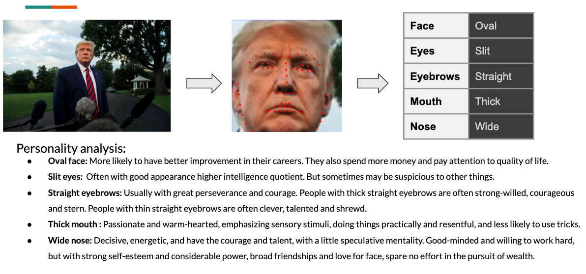
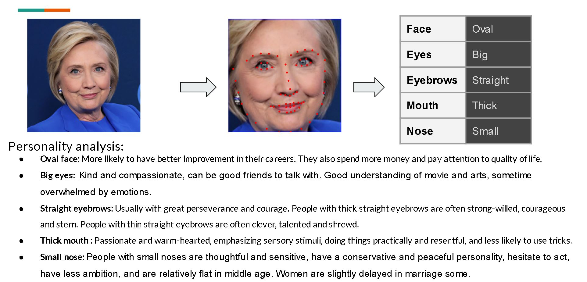

# Face to Fate

## Motivation

In the process of people’s interaction, they often subconsciously judge a person's personality through their appearance. For example: In an interview, you usually judge the interviewer's preferences by observing the interviewer's appearance. On the contrary, HR also judges the candidate’s personality characteristics by observing the candidate’s facial expressions. So in this project, we want to judge the possible personality of people by analyzing the predictions of their facial features.

## Data

- [Dataset link](https://drive.google.com/file/d/1b6Vgn0fTQQKsvInQak4OLx8PpKtGl50M/view)

### Data Directory Structure
```bash
data
├── eye
│   ├── test
│   │   ├── big
│   │   ├── silt
│   │   └── small
│   └── train
│       ├── big
│       ├── silt
│       └── small
├── eyebrow
│   ├── test
│   │   ├── Arch
│   │   ├── Circle
│   │   └── Straight
│   └── train
│       ├── Arch
│       ├── Circle
│       └── Straight
├── jaw
│   ├── test
│   │   ├── circle
│   │   ├── oval
│   │   ├── square
│   │   └── triangle
│   └── train
│       ├── circle
│       ├── oval
│       ├── square
│       └── triangle
├── mouth
│   ├── test
│   │   ├── medium
│   │   ├── small
│   │   └── thick
│   └── train
│       ├── medium
│       ├── small
│       └── thick
└── nose
    ├── test
    │   ├── long
    │   ├── small
    │   └── wide
    └── train
        ├── long
        ├── small
        └── wide

```

## System Requirements

- dlib
- sklearn
- opencv-python
- numpys
- pytorch

## Test on your image

- Step 1: Choice one image you like and put it in the folder "demo\images\img"
- Step 2: Change the input image path in demo jupyter file "demo\CNN_demo" or "demo\SVM_demo"
- Step 3: Run the cells in demo jupyter file one by one to get your report

- P.S. Our model are sensitive to the angle to face, please choose an image of frontal face

## Example



	
